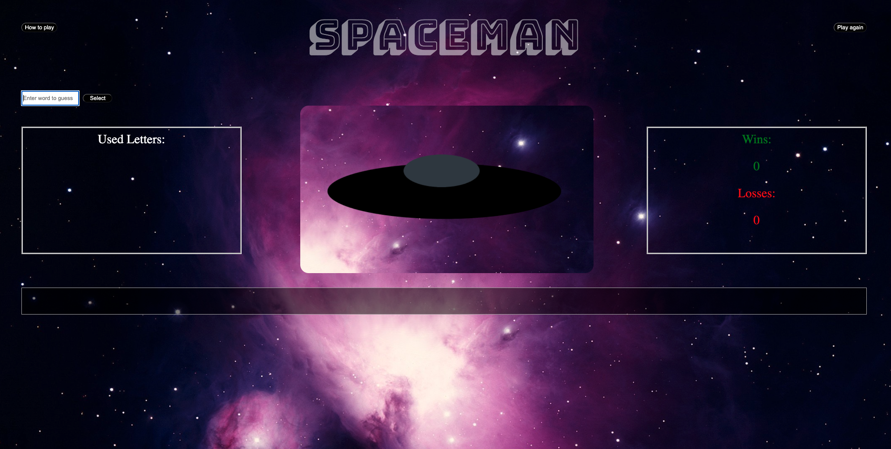

*
*

Spaceman is the best alternative to hangman, and the games UI is very easy to use and understand!

## How to use

-Player 1, enter a word into the input field provided
-Player 2, enter a letter at a time that you think might belong to the word provided by player 1
-Player 2 wins if the word is formulated within 7 tries
-Player 2 loses if the word is not formulated within 7 tries

## Functionality 

-An input field is provided next to a submit button where the first user enters the word
-A reset button is on the top right side of the screen that can be used to restart the game for any reason 
-The second user must guess that word using letters that it could potentially contain into the second input field that appears after the first users turn
-A box on the left provides the second user with information on the letters previously guessed
-Every wrong guess adds to the space ship and builds it
-On the right side of the screen is a scoreboard that collects information based on the second players wins and losses and stores it in the local memory of the users computer
-At the bottom is a box field that provides the second user with information on their current correct guesses and progress on formulating the word provided by the first user

## Wireframes
-https://whimsical.com/PVu8DC1QD7JF44bgW2mydV

## User Stories
As a user, I want to start with a text field so that the first player can provide an input word.
As a user, I want to make guesses to try to identify what letters are in the word present so that I can identify the word.
As a user, I want to prevent the ufo from being built by making correct guesses so that I can win the game.
As a user, I want continue to win so that the number of wins on the right accumulate.
As a user, I want to hit the reset button if I accidentally type in the wrong letter so that I don't accumulate more losses.

## Layout

## Code

